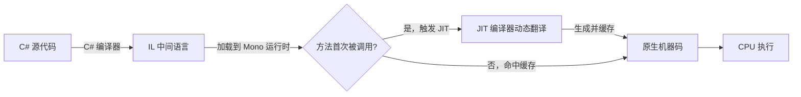
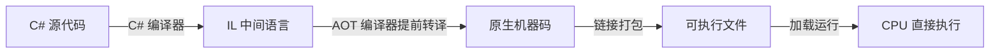
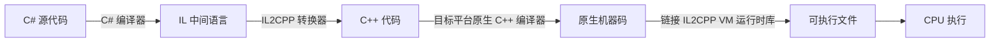

# 简介
本章节属于编程语言与底层原理系统。目的是解开Unity底层的运行原理，从使用API到深度理解Unity。
# 内容
## Unity的编辑器本质
Unity做为一款游戏引擎是如何组成以及怎么提供轮子，为游戏开发者服务的。
### Unity的组成
Unity采用Native 与 Managed 双层混合，名字听起来挺唬人，不过却很好理解。
Native是**本地层**，是Unity的最底层C++编译完成的机器码，其中本地层包含了引擎核心，渲染，物理，资源管理，编辑器UI，SceneView / Inspector / Gizm等。
本地层是已经被编译成机器码，可以被CPU直接执行，性能高，控制底层
PS:机器码：是计算机能够直接识别和执行的低级编码语言，是接近硬件层的编程语言。

Managed是**通用业务处理层**，是我们利用Unity编写的C#脚本所在的层级，包含游戏逻辑，编辑器扩展，工具脚本，用户逻辑等。
该层级的运行方式将会是下面的重点内容。

### Unity脚本运行逻辑
在Managed层写完脚本，脚本是怎么通过一些列过程变成可以在不同平台可运行的软件呢？

**IL（ .NET 框架中的中间语言）**
IL（Intermediate Language） 是 .NET 框架中的中间语言，也称 CIL（Common Intermediate Language） 或 MSIL（Microsoft Intermediate Language）。C#、VB.NET 等源代码会先被编译器（如 csc.exe）编译成 IL 字节码，而不是直接生成 CPU 可执行的机器码。

**Mono/.NET 虚拟机**
Mono/.Net虚拟机简称为Mono虚拟机，它是一个跨平台的 .NET 运行环境，提供一整套工具集运行.NET。由于 CPU 无法直接理解 C# 源代码，C# 代码首先会被编译成一种平台无关的中间语言（IL 字节码）。
其中Mono虚拟机包括的核心组件有
1.C#编译器：负责将 C# 源代码编译为符合 ECMA 标准的通用中间语言（CIL）字节码。
2.CLR 运行时（公共语言运行时）：这是虚拟机的“大脑”。它负责在程序运行时管理内存、类型系统、线程调度以及代码的执行。
3.核心类库（BCL）：提供了大量预构建的功能（如网络、文件 I/O、集合等），使得开发者无需从零开始编写底层代码
执行机制：JIT和AOT
1.JIT（即时编译）：在程序运行时，将中间语言动态翻译为本地机器码。这种方式编译快，支持快速生成-部署-调试周期，非常适合开发阶段使用。
2.AOT（提前编译）：在构建阶段就将代码编译为静态链接的原生可执行文件，彻底消除运行时的编译开销。
内存管理：垃圾回收（GC）
Mono 虚拟机内置了垃圾回收机制（如 SGen GC），能够自动管理托管内存的分配与释放，开发者无需像 C++ 那样手动 new 和 delete。

**IL2CPP（Intermediate Language To C++）**
它是Unity 引擎开发的一种核心脚本后端，用于替代传统的 Mono 后端。它的核心机制是在构建阶段，将 C# 脚本编译生成的中间语言（IL）代码转换为 C++ 代码，然后再通过目标平台的原生编译器（如 MSVC、Clang、GCC）编译为原生二进制机器码文件（如 .exe、.apk、.so 等）
它的架构主要由两部分组成：
1.AOT 编译器（il2cpp.exe）：由 C# 编写，负责在构建阶段完成 IL 到 C++ 的转换。
2.运行时库（libil2cpp）：主要由 C++ 编写并作为静态库链接。运行时不依赖 JIT 编译器，仅通过该轻量级运行时库提供垃圾回收（GC）、线程管理、文件访问等基础服务

**IL2CPP与Mono虚拟机的区别**
要想说清楚IL2CPP与Mono虚拟的区别，要先了解其运行的流程以及JIT和AOT的区别
**Mono虚拟机循环**

**IL2CPP循环**

PS：现在通过这个流程图我们得知IL2CPP不同在它把IL转成了C++，再利用目标平台的原生 C++ 编译器，转成目标平台CPU可运行的机械码，很巧妙的解决了兼容性问题和性能优化。

**AOT和JIT的区别**
| 视角 | AOT | JIT |
|:---|:---|:---|
| 核心思想 | "提前把所有翻译工作做完" | "边跑边翻译，用到再译" |
| 牺牲什么 | 动态能力 + 开发期编译速度 | 启动速度 + 内存空间 |
| 换取什么 | 极致运行性能 + 极低内存 + 高安全性 + 全平台兼容 | 开发期极速反馈 + 动态代码生成 + 运行时智能优化 |
| 工程策略 | Release 阶段使用（追求性能和安全性） | Editor/调试阶段使用（追求开发效率） |

通过上面对脚本后端（Mono和IL2CPP）的了解，我相信你已经大致了解Unity底层的原理，是怎么组成的怎么在个平台运行的。